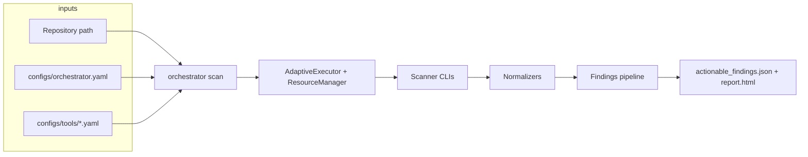

# AFSS Orchestrator

**Agent-first security scanner orchestrator** — resource-aware scheduling, normalization, and reporting for many CLI scanners behind one command.

## Overview

- **Consistent environment**: Dockerfile bundles common scanners and Go so you are not fighting missing binaries or version drift.
- **Resource-aware execution**: Weighted parallelism plus an extra gate for IO-heavy tools; integrates with optional host CPU/RAM monitoring.
- **Unified output**: Raw tool JSON is normalized, deduplicated, correlated, and filtered into `results/actionable_findings.json` and an HTML summary.

## Architecture



## Quick start (Docker)

**Requirements:** Docker with Compose plugin, ~4 GB RAM recommended.

```bash
export REPO_PATH=/absolute/path/to/repo/to/scan
docker compose up --build
```

Results:

- **HTML:** `results/report.html`
- **Primary JSON:** `results/actionable_findings.json` (normalized findings + `correlations`)

`REPO_PATH` defaults to `/tmp` in `docker-compose.yml` so `docker compose build` works on a clean clone; set a real path before `up` when scanning a repo.

## Clone on another machine

```bash
git clone <your-remote-url> afss-orchestrator
cd afss-orchestrator
export REPO_PATH=/absolute/path/to/repo/to/scan
docker compose up --build
```

Only source and YAML configs are meant to be committed; local binaries, `/tools/` vendor tree, `/audits/`, `/results/`, and secrets stay out of git (see `.gitignore`). After fixing ignore rules, add missing source once: `git add cmd/orchestrator pkg/tools configs/tools pkg/util docs` (adjust to taste) before the first push.

## Local development

**Requirements:** Go **1.24+** (see `go.mod`), scanner binaries on `PATH` (or paths in tool YAML).

Build:

```bash
go build -o orchestrator ./cmd/orchestrator
```

Run a scan:

```bash
./orchestrator scan /path/to/repo
```

Other commands:

```bash
./orchestrator monitor
./orchestrator config init
./orchestrator config validate
```

## Configuration

| Path | Role |
|------|------|
| `configs/orchestrator.yaml` | Global timeouts, parallelism, resource thresholds, results directory |
| `configs/tools/*.yaml` | Per-tool command, args, enable flag, resource profile |

If `configs/tools/` is empty, generate defaults:

```bash
./orchestrator config init
```

Then edit the generated YAML files as needed.

## Features (short)

- **Many normalizers** — Bandit, Checkov, Gitleaks, Gosec, Govulncheck, Hadolint, njsscan, OSV, Semgrep, Trivy, TruffleHog, and more, registered in `pkg/normalizers`.
- **Robust JSON ingestion** — Strips CLI noise before `{` / `[` when tools print warnings ahead of JSON.
- **Findings pipeline** — Deduplication, correlation, and filtering before export (`pkg/findings_processor`).

## Development

```bash
go test ./... -timeout 120s
```

Clean local artifacts (optional):

```bash
rm -rf results/* debug_results/*
```

## Contributing

Issues and PRs are welcome—especially for new normalizers and safer tool defaults.

## License

MIT License.
