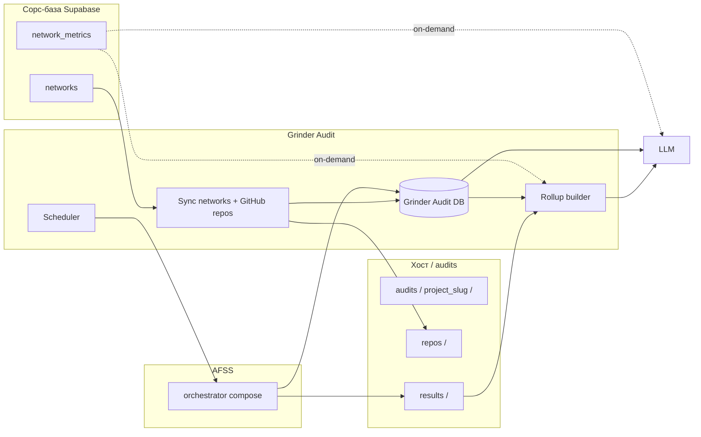

# Grinder Audit — пайплайн A (каталог из сорс-базы + локальный аудит)

Документ описывает **оркестрированный** аудит по **каталогу проектов**: стабильная связь с продуктом — **`networks.id`** (UUID) в Supabase; карточка и **`github_link`** — из **`networks`**. Таблица **`network_metrics`** в Grinder **не зеркалится** по умолчанию (см. §3.2): при необходимости — запрос в сорс по `network_id`. Каждый проект — папка `audits/<slug>/`. **Pharos** в репозитории — лишь **пример** дерева (`audits/Pharos/`), а не имя пайплайна.

Связанный документ: [ARCHITECTURE_PIPELINE_TELEGRAM.md](./ARCHITECTURE_PIPELINE_TELEGRAM.md).

---

## Почему раньше «цеплялись к Pharos»

В кодовой базе уже был готовый прогон AFSS + скрипты в `audits/Pharos/`, поэтому в черновике архитектуры фигурировали те же пути. Логика Grinder **не завязана** на Pharos: оркестратор AFSS общий, а **корень клонов и `results/`** задаётся переменной окружения и структурой папки проекта.

---

## 1. Цели и границы

**Цели**

- Тянуть каталог сетей для аудита из **`networks`** (`id`, `name`, `github_link`, …).
- **Жёстко связать** каждый прогон GitHub/AFSS с **`networks.id`** (UUID) — это главный внешний ключ; без дублирования всей таблицы метрик в локальной БД.
- Для каждой записи каталога — папка `audits/<project_slug>/` с `repos/`, `results/`, `logs/` (и своим `repos_manifest.txt` при необходимости).
- Хранить **историю прогонов** и rollup в **Grinder Audit DB** (отдельно от тяжёлых JSON в `results/`).
- **Повторные прогоны (например раз в неделю)** без полного переклонирования: обновление рабочих копий через **`git fetch` / `git pull`** (или `git remote update` + merge/rebase по политике), фиксация **`git_commit_sha`** до/после скана.
- Детерминированный **rollup** для дашбордов и для LLM.

**Не цели (v0)**

- Замена оркестратора AFSS; Grinder — надстройка (sync, расписание, ingest, rollup).

---

## 2. Высокоуровневая схема



**Поток данных**

1. **Sync сорса**: чтение **`networks`** (watermark по `updated_at`), нормализация `github_link` → org/login, список репо через GitHub API при необходимости. **`network_metrics`** не тянем пачкой в локальную БД.
2. **Рабочие клоны**: под `audits/<slug>/repos/<repo_name>/` — первый раз `git clone`, далее **`git fetch` + fast-forward или merge`** (полный reclone только по флагу политики: смена URL, битый репозиторий, смена default branch).
3. **Scan job**: планировщик пишет `runs` с **`source_network_id` = `networks.id`**, запускает AFSS с `REPO_PATH` на нужный клон, по завершении — пути к `audits/<slug>/results/...`.
4. **Ingest**: rollup из `actionable_findings.json` → `run_rollups`.
5. **LLM / отчёты**: rollup + **`networks.id`**; поля карточки и метрики — **из сорса по запросу** (`networks` / `network_metrics` по `network_id`), без полного JSON всех репо в один промпт.

---

## 3. Сорс-база Supabase — таблицы и поля (как в экспорте JSON)

Ниже — **имена колонок**, как в бэкапе `tables/json/*.json` (типичный экспорт PostgREST/скрипта). Реальная БД может иметь те же имена в snake_case.

### 3.1. Таблица `networks` (карточка проекта / сети)

Использование для аудита: **`id`** (UUID) как стабильный ключ каталога; **`name`** → человекочитаемое имя и база для `project_slug` (нормализовать в slug); **`github_link`** → разбор org и список репозиториев; остальное — контекст для скоринга/LLM.

| Поле | Назначение в пайплайне |
|------|-------------------------|
| `id` | PK в сорсе; в Grinder — `source_network_id` / тот же UUID в зеркале. |
| `legacy_id` | Справочно, миграции. |
| `name` | Отображение; основа для `audits/<slug>/`. |
| `phase` | Когорта (testnet / main / …) для отчётов. |
| `htw_link` | Внешний материал (не для скана). |
| `description` | Текст для LLM/дашборда. |
| `explorer` | Ссылка (не для скана). |
| `founded` | Год (контекст). |
| `native_token` | Контекст. |
| `username` | Соц/X (контекст). |
| `website` | URL проекта. |
| `docs` | Документация. |
| **`github_link`** | **Источник org/repo** для клонирования и GitHub API. |
| `discord` | Контекст. |
| `logo_link` | UI. |
| `network_type` | Классификация. |
| `network_full_type` | Классификация. |
| `investors` | Контекст для narrative. |
| `ecosystem` | URL/текст. |
| `created_at`, `updated_at` | Инкрементальный sync: «брать только `updated_at` > watermark». |
| `hot`, `fresh` | Продуктовые флаги/скоры в сорсе. |
| `supported_chains` | JSON/null. |
| `perspective_logo`, `perspective_logo_2` | UI. |

### 3.2. Таблица `network_metrics` — **не часть локального ядра Grinder**

- В сорсе таблица по-прежнему существует (`network_id` → `networks.id`, плюс `moniscore`, `tvl`, `git_activity`, …).
- **В локальной БД Grinder отдельную таблицу «копия network_metrics» заводить не требуется**: всё уже есть в Supabase; дублирование усложняет sync и расходится с источником.
- Если для rollup/скоринга нужны **1–2 числа**, их можно:
  - либо **джойнить в момент отчёта** запросом к Supabase по `network_id`,
  - либо класть **снимок в JSON** внутрь `run_rollups` на момент прогона (точка во времени), без нормализованной таблицы метрик.

Справочный перечень колонок `network_metrics` (для SQL/PostgREST при on-demand запросах) см. бэкап `tables/json/network_metrics.json`; в архитектуре Grinder **не перечисляем все поля** как обязательные к хранению.

---

## 4. Grinder Audit DB — локальная модель (над сорсом)

Рекомендация по движку: **SQLite** в volume (`grinder_audit.db`) на хосте/в compose; при росте — PostgreSQL с той же логической схемой.

Смысл слоёв:

| Локальная сущность | Связь с сорсом |
|--------------------|----------------|
| `audit_network` | **`source_network_id` = `networks.id` (UUID)** — главная связь; опционально кэш `name`, `github_link`, `phase` для офлайна. |
| `audit_repo` | Репозиторий GitHub внутри org; **`audit_network_id`** FK; `clone_path` под `audits/<slug>/repos/...`. |
| `runs` | Прогон AFSS: **`source_network_id`** (= `networks.id`, UUID) и/или `audit_repo_id`, `git_commit_sha`, `status`, `results_dir`, … |
| `run_rollups` | JSON rollup (см. §7); при необходимости **снимок** пары метрик на момент прогона — только внутри JSON, без таблицы-копии `network_metrics`. |
| `finding_fingerprints` (опц.) | Дифф «новых» находок между прогонами. |

**Ключевой инвариант:** любой rollup/отчёт по прогону адресуется по **`networks.id`**, чтобы при необходимости подтянуть поля из сорса (`networks` / **on-demand** `network_metrics`) без локальной копии метрик.

**Инварианты**

- Один `runs` — один физический прогон AFSS по одному клону.
- Rollup не дублирует полный список findings.

---

## 5. Клоны и «дифы» вместо полного переклонирования

- **Первый прогон**: `git clone` (по желанию `--depth 1`; тогда история секретов ограничена — как в `audits/Pharos/README.md`).
- **Следующие прогоны** (например раз в неделю): в существующем рабочем дереве:
  - `git remote -v` проверка,
  - `git fetch origin` (или `--prune`),
  - обновление рабочей копии: **`git merge --ff-only`** или **`git pull --ff-only`** если политика linear; иначе явный merge/rebase по правилам команды.
- В `runs` сохранять **`git rev-parse HEAD`** до fetch (опционально) и после обновления — как **`git_commit_sha`** сканируемого состояния.
- **Полный reclone** — только при: смене `github_link`, неустранимом повреждении, смене политики глубины clone, ручном флаге.

Так вы пишете в историю **дифф коммита** (через SHA между прогонами), а не «дифф файлов» в БД: для аудита достаточно знать, **какой коммит сканировали**.

---

## 6. Синхронизация с GitHub (поверх сорса)

- Из `networks.github_link` извлекается org (или owner) для `GET /orgs/{org}/repos` / user repos.
- `GITHUB_TOKEN` read-only, пагинация, политика по fork/archived.
- Строки в `audit_repo` upsert по `(audit_network_id, github_repo_id)` или `(audit_network_id, slug)`.

Опционально: локальный **`repos_manifest.txt`** в папке проекта как allowlist поверх полного списка org.

---

## 7. Rollup — контракт JSON (`grinder.rollup.v1`)

Без изменения идеи: агрегаты по `actionable_findings.json`, топ правил/файлов, `correlations_count`, счётчики парсеров (`hadolint_parse_errors`), см. предыдущая версия примера JSON в репо (при реализации — единый файл схемы).

### 7.1. Встроенная папка аудита **внутри клонируемого репозитория** (обязательно для LLM)

Во многих проектах уже лежат отчёты стороннего/внутреннего аудита (`audits/`, `security/`, `docs/audit/`, `*.sarif`, и т.д.). Это **не дублирование** результата AFSS: наш прогон даёт **свежий инструментальный** срез, папка в репо — **контекст команды** (что они уже знали, как формулировали риски). LLM **должен** иметь возможность эти файлы прочитать, когда они есть.

**Требование к коду (ingest / post-scan):**

1. После (или до) скана по корню клона (`REPO_PATH`) выполняется **детектор**: список путей по **конфигу** (glob / имена каталогов / маркер-файл).
2. В **`run_rollups.payload_json`** (или рядом машиночитаемый sidecar на диске) записывается блок, например:

```json
"embedded_repo_audit": {
  "present": true,
  "paths_relative": ["audits/README.md", "security/report.pdf"],
  "detector_version": "1",
  "note": "LLM: при present=true прочитай эти пути в репозитории до итоговых выводов."
}
```

3. Если ничего не найдено — `"present": false` (явная пометка **снимает неопределённость** у LLM: «искали — пусто», а не «забыли проверить»).

**Опционально:** в корне репозитория поддерживается явный маркер **`.grinder-embedded-audit.json`** (массив путей или glob), чтобы команда сама указала, что отдавать агенту — детектор мержит маркер с эвристиками.

**Промпт-правило для LLM:** при `embedded_repo_audit.present === true` сначала просмотреть перечисленные пути (или запросить их содержимое через инструмент), затем сопоставить с rollup AFSS; не считать встроенный аудит «лишним» контекстом.

---

## 8. Расписание (раз в неделю)

- Флаги на уровне **`audit_repo`** или **`audit_network`**: `is_scheduled`, `schedule_cron`.
- Scheduler с блокировкой в БД, чтобы не запустить два скана на один клон.
- Перед сканом — шаг **git update** (§5).

---

## 9. Скоринг

- **Детерминированно**: веса по severity из **rollup аудита**; при необходимости сигналы из **`network_metrics`** — **один запрос в Supabase** по `network_id = networks.id` (или заранее выбранные поля в снимке внутри `run_rollups`), без отдельной зеркальной таблицы метрик в Grinder.
- **LLM**: narrative поверх rollup + при необходимости **точечный** запрос к сорсу по UUID сети; если в клоне обнаружен встроенный аудит — см. **§7.1** (обязательный контекст, не шум).

---

## 10. Контейнеры и тома

| Компонент | Где живёт |
|-----------|-----------|
| SQLite Grinder | volume или `./audits/GrinderAudit/data/grinder_audit.db` |
| Клоны и результаты | **`audits/<project_slug>/repos/`**, **`audits/<project_slug>/results/`** |
| AFSS orchestrator | без смены контракта; `REPO_PATH` указывает на конкретный клон |
| Post-scan hook | после копирования/генерации `results/` — вызов `grinder ingest` для записи `runs` / rollup |

---

## 11. Этапы внедрения

1. ETL / sync: Supabase **`networks`** → локальный mirror в SQLite (watermark по `updated_at`); **`network_metrics` не зеркалим** — только клиент для on-demand запросов при скоринге/отчёте.
2. Разбор `github_link` + заполнение `audit_repo` + клоны в `audits/<slug>/repos/`; каждый `runs` с **`source_network_id`**.
3. `grinder ingest` + rollup + **детектор `embedded_repo_audit`** (§7.1).
4. Планировщик + git increment (§5).
5. Формула `repo_scores` / network scores: rollup + **при необходимости** выборочные поля из сорса `network_metrics` по `network_id` (§3.2).

---

## 12. Открытые решения

- Нормализация **`name` → `project_slug`** (уникальность, коллизии имён).
- Источник rollup: файл на диске до/после шага корреляций — один источник зафиксировать в коде.
- Один SQLite на все проекты vs файл на `audit_network` (обычно один проще для запросов «по всем сетям»).
