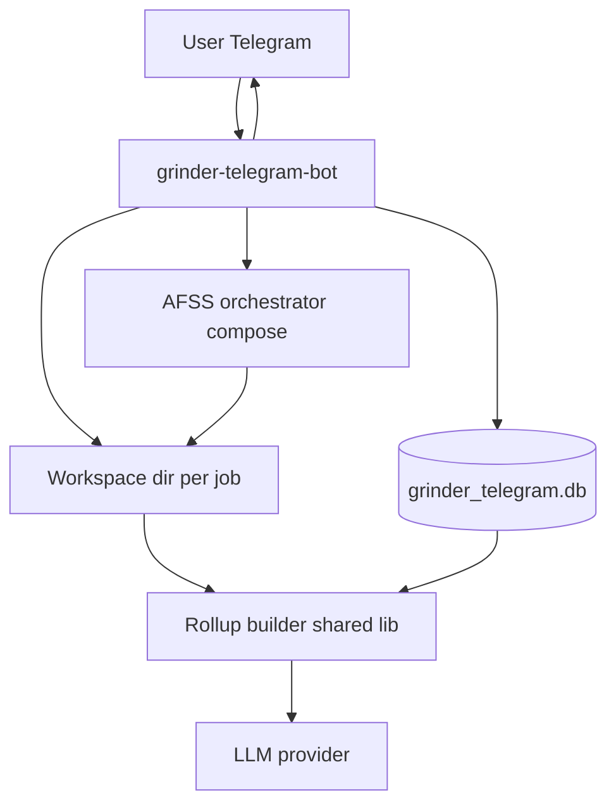

# Grinder Audit — архитектура пайплайна B (Telegram / ad-hoc)

Документ описывает **второй** поток: пользователь кидает боту ссылку на Git (org, repo или список), бот клонирует проект(ы), гоняет те же сканеры, пишет в **свою** БД Grinder Audit и отдаёт LLM сжатый контекст. Без привязки к **Supabase `networks` / каталогу проектов** из пайплайна A.

Пайплайн A (сорс-база, org-wide, недельные прогоны): [ARCHITECTURE_PIPELINE_MANIFEST.md](./ARCHITECTURE_PIPELINE_MANIFEST.md).

---

## 1. Цели и отличия от пайплайна A

**Цели**

- Минимальный UX: **одна ссылка** → клон → скан → краткий отчёт в чат + опционально файл.
- Изолировать данные пользователя от **пайплайна A** (общий каталог `audits/<slug>/`): **отдельная папка**, **отдельный volume БД**, отдельные лимиты CPU/времени.
- Переиспользовать **тот же контракт rollup** (`grinder.rollup.v1`), что и в пайплайне A, чтобы один код агрегации и один формат для LLM.

**Отличия**

| Аспект | A (Manifest) | B (Telegram) |
|--------|----------------|--------------|
| Источник списка репо | Манифест / GitHub org sync | URL от пользователя |
| Планировщик | Да (неделя и т.д.) | Обычно нет; только on-demand |
| Хранение клонов | `audits/<project_slug>/repos/` (пайплайн A) | например `audits/TelegramGrinder/workspaces/<user_hash>/<job_id>/` |
| БД | Можно общий инстанс с префиксом `tenant` или отдельный файл | **Рекомендуется отдельный SQLite файл** `grinder_telegram.db` |

---

## 2. Компоненты

**Папка репозитория кода бота** (предложение):  
`/home/htw/.asff/audits/TelegramGrinder/bot/` — код бота, Dockerfile, `requirements.txt` или Go-модуль.  
Не смешивать с рабочими клонами пайплайна A по умолчанию.

---

## 3. Модель данных (та же логика, другой tenant)

Расширение общей схемы одним полем:

- `projects` / `repos` / `runs` / `run_rollups` — как в документе A.
- Добавить **`tenant_id`** или `source_pipeline` (`manifest` | `telegram`) + `telegram_user_id` (хэшированный в логах) для разграничения.

**Альтернатива (проще для v0)**

- Физически **второй файл SQLite** только для бота: дублирование миграций допустимо, меньше риска пересечь данные пайплайна A.

---

## 4. Обработка сообщения пользователя

### 4.1. Поддерживаемые ссылки (v0)

- `https://github.com/org/repo`
- `https://github.com/org/repo.git`
- Опционально позже: GitLab, сырой `git@github.com:org/repo.git`

### 4.2. Job state machine

`received` → `cloning` → `scanning` → `ingesting` → `summarizing` → `done` | `failed`

Сообщения в чат: короткий статус на каждый переход; при `failed` — последние N строк лога без секретов.

### 4.3. Клонирование

- Shallow clone по умолчанию (`--depth 1`), с предупреждением пользователю (как в README шаблона `audits/` для секретов).
- Для monorepo — один workspace = один корень; оркестратор сканирует как сейчас `REPO_PATH`.

### 4.4. Запуск скана

- Тот же образ оркестратора или **вызов уже собранного** `docker compose` с `REPO_PATH` на workspace.
- Ограничения: timeout job-level, max размер диска, denylist путей.

---

## 5. LLM в боте

**Вход**

- `run_rollups.payload_json` для последнего `runs` по job.
- Метаданные: slug, время, exit_code, ссылка на исходный Git (без токена).

**Не входить**

- Полный `actionable_findings.json` в первый запрос.

**Опциональный второй шаг**

- Кнопки inline: «Топ 5 по severity», «Только trivy» — бот читает с диска фрагмент JSON и делает второй короткий вызов LLM или просто фильтр без LLM.

---

## 6. Безопасность и злоупотребления

- **Rate limit** по `user_id` и по IP (если прокси).
- Максимальный размер репо / глубина submodule (политика: submodules off по умолчанию).
- Запрет приватных репо без OAuth (v0 только публичный clone по HTTPS).
- Секреты бота и LLM — env; workspace после job — удаление по TTL (например 24h) или сразу после успешной выдачи rollup, если полные результаты не нужны.

---

## 7. Деплой

- Контейнер **bot** + опционально **sidecar** с Docker socket (если бот триггерит `docker run`) — осознанный риск; альтернатива: бот ставит задачу в **очередь** (Redis), worker с docker socket выполняет скан.
- Рекомендация: **очередь + worker** с жёсткими лимитами, бот без доступа к docker socket.

---

## 8. Общий код с пайплайном A

Вынести в общий пакет (язык по выбору репозитория):

- Парсинг `actionable_findings.json` → структура rollup `grinder.rollup.v1`.
- Запись в `run_rollups`.
- (Позже) Diff «новых» finding keys между двумя run.

Бот и post-hook пайплайна A вызывают одну библиотеку.

---

## 9. Этапы внедрения

1. Репозиторий `audits/TelegramGrinder/bot` + Dockerfile.
2. Job runner (queue или subprocess) с таймаутом.
3. Интеграция rollup + запись в SQLite.
4. LLM: один системный промпт + rollup JSON.
5. UX: ссылка, прогресс, итоговое сообщение + опционально `summary.md` файлом.

---

## 10. Открытые решения

- Docker-in-Docker vs mounted host docker vs Kubernetes Job — зависит от среды хоста.
- Нужна ли выдача пользователю zip `results/` или достаточно текста в чате.
